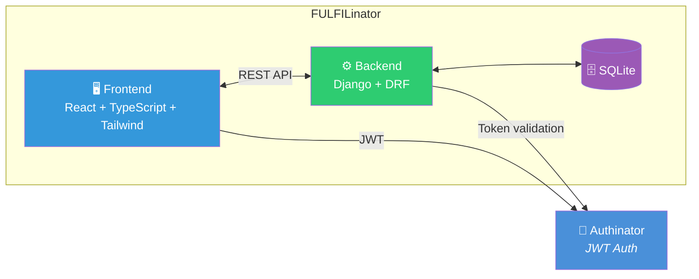

# 🚚 FULFILinator

> *"Behold! The FULFILinator! It tracks every purchase order, every order, every delivery — with an iron grip! No item shall slip through the cracks of the Tri-State Area's supply chain!"*

Order fulfillment tracking system for the complete **PO → Order → Delivery** pipeline. Part of the [Inator Platform](https://github.com/losomode/inator) family.

**Admins** manage the full lifecycle — creating POs, placing orders, shipping deliveries, tracking serial numbers. **Customers** get clear visibility into what's been ordered, what's shipped, and what's left.

## How It Works


Each step updates the one before it. Deliver 5 of 10 items? The order knows. The PO knows. Everyone knows. No spreadsheets. No guessing.

### The Fulfillment Pipeline

```mermaid
graph TB
    subgraph "PO Management"
        CREATE_PO[Create PO<br/><i>Items, quantities, prices</i>]
        TRACK_PO[Track Fulfillment<br/><i>Ordered / Remaining / Waived</i>]
        CLOSE_PO[Close PO<br/><i>All items fulfilled or waived</i>]
    end

    subgraph "Order Management"
        CREATE_ORD[Create Order<br/><i>Auto-allocate from oldest PO</i>]
        TRACK_ORD[Track Deliveries<br/><i>Shipped / Remaining</i>]
        CLOSE_ORD[Close Order<br/><i>All items delivered</i>]
    end

    subgraph "Delivery Management"
        CREATE_DEL[Create Delivery<br/><i>Link to order, assign serials</i>]
        SHIP[Ship<br/><i>Tracking number + serial per item</i>]
        CLOSE_DEL[Close Delivery<br/><i>Confirmed received</i>]
    end

    CREATE_PO --> TRACK_PO
    TRACK_PO --> CLOSE_PO
    CREATE_ORD --> TRACK_ORD
    TRACK_ORD --> CLOSE_ORD
    CREATE_DEL --> SHIP --> CLOSE_DEL

    CREATE_ORD -.->|updates| TRACK_PO
    CLOSE_DEL -.->|updates| TRACK_ORD

    style CREATE_PO fill:#3498db,color:#fff
    style TRACK_PO fill:#3498db,color:#fff
    style CLOSE_PO fill:#2c3e50,color:#fff
    style CREATE_ORD fill:#e67e22,color:#fff
    style TRACK_ORD fill:#e67e22,color:#fff
    style CLOSE_ORD fill:#2c3e50,color:#fff
    style CREATE_DEL fill:#27ae60,color:#fff
    style SHIP fill:#27ae60,color:#fff
    style CLOSE_DEL fill:#2c3e50,color:#fff
```



## Architecture



| Layer | Stack |
|-------|-------|
| Backend | Python 3.11+, Django + DRF, SQLite (port **8003**) |
| Frontend | TypeScript (strict), React 19, Vite, Tailwind CSS (unified SPA) |
| Auth | JWT via [Authinator](https://github.com/losomode/AUTHinator) |
| Testing | pytest + coverage (backend), Vitest + RTL (frontend) |
| Task Runner | [Task](https://taskfile.dev/) |

## Quick Start

Requires Python 3.11+, Node.js 18+, and [Task](https://taskfile.dev/) (`brew install go-task`).

### Platform Mode (Recommended)

If you're using the [Inator Platform](https://github.com/losomode/inator):

```bash
# From the platform root (inator/)
task setup           # Sets up all inators including Fulfilinator
task start:all       # Starts all services + unified frontend + gateway

# Access at http://localhost:8080
```

### Standalone Mode

```bash
# Clone the repo
git clone https://github.com/losomode/FULFILinator.git
cd Fulfilinator

# Install dependencies
task install

# Configure environment
cp backend/.env.example backend/.env
# Edit backend/.env to set AUTHINATOR_API_URL and other settings

# Setup database
task backend:migrate

# Start backend (port 8003)
task backend:dev

# In another terminal — start frontend (port 3003, standalone only)
task frontend:dev
```

**Note**: When running via the Inator Platform, the frontend is served from the unified SPA at `inator/frontend/`. The standalone frontend is only for isolated development.

### Troubleshooting Fresh Installs

If services fail to start, check:

```bash
# Verify .env exists
ls -la backend/.env

# Run migrations if database doesn't exist
task backend:migrate

# Check that dependencies installed correctly
ls -la .venv/                    # Backend venv should exist
ls -la frontend/node_modules/    # Frontend deps should exist

# View logs if running via platform orchestrator
tail -50 /path/to/logs/Fulfilinator-backend.log
tail -50 /path/to/logs/Fulfilinator-frontend.log
```

### Task Reference

```bash
task                      # List all tasks
task check                # Pre-commit: fmt + lint + test + coverage
task test:coverage        # All tests with ≥85% coverage gate
task build                # Production frontend build
task db:reset             # ⚠️  Nuclear option — wipes the database
task stats                # Project statistics
```

<details>
<summary>More tasks</summary>

```bash
# Backend
task backend:test            # Run backend tests
task backend:test:coverage   # Backend tests with coverage
task backend:lint            # Lint with ruff
task backend:shell           # Django shell

# Frontend
task frontend:test           # Run frontend tests (239 tests)
task frontend:test:coverage  # Frontend tests with ≥85% coverage
task frontend:lint           # ESLint
task frontend:typecheck      # TypeScript strict mode
```

</details>

## Key Features

🔄 **Automatic PO Allocation** — Orders draw from the oldest PO first, respecting quantities and contracted prices. PO-1 at $2,000/unit gets consumed before PO-2 at $2,100/unit. No manual bookkeeping.

🚫 **Over-delivery Prevention** — You can't ship more than was ordered. The system enforces quantity limits per order line item across all deliveries.

🔢 **Serial Number Tracking** — Every physical item in a delivery gets a unique serial number. Duplicates are rejected. Search any serial to find its delivery instantly.

✨ **Quantity Waiving** — Customer only wants 8 of 10 units? Admins can waive the remainder with a reason, letting POs close cleanly without phantom inventory.

🔓 **Admin Override Close** — When items remain but the PO needs to close, admins can force it with a justification. The system confirms before proceeding.

⚠️ **Field-Level Validation** — API errors highlight the exact form field that failed. No more guessing which of your 12 line items has a blank serial number.

📎 **Attachments** — Upload files to POs, Orders, or Deliveries. Link Google Docs and HubSpot deals on POs.

🔒 **Multi-Tenant Isolation** — Customers see only their own data. Admins see everything.

🎨 **Unified UI** — Integrated into the platform's single-page React app with dark/light mode support.

## Roles

| Role | Scope |
|------|-------|
| **SYSTEM_ADMIN** | Full access to all data and features across all customers |
| **CUSTOMER_ADMIN** | Manage users and data within their customer account |
| **CUSTOMER_USER** | View and edit their customer's POs, orders, and deliveries |
| **CUSTOMER_READONLY** | View-only access to their customer's data |

Roles come from the JWT issued by [Authinator](https://github.com/losomode/AUTHinator). FULFILinator never stores credentials.

## API

All endpoints live under `/api/fulfil/` and require a valid JWT (except health check). Full OpenAPI docs available at `/api/fulfil/docs/`.

```
GET  /api/fulfil/health/                        # Health check (no auth)

CRUD /api/fulfil/items/                         # Item catalog
CRUD /api/fulfil/purchase-orders/               # Purchase orders
POST /api/fulfil/purchase-orders/:id/close/     # Close PO
POST /api/fulfil/purchase-orders/:id/waive/     # Waive remaining qty
CRUD /api/fulfil/orders/                        # Orders
POST /api/fulfil/orders/:id/close/              # Close order
CRUD /api/fulfil/deliveries/                    # Deliveries
POST /api/fulfil/deliveries/:id/close/          # Close delivery
GET  /api/fulfil/deliveries/serial-search/?q=   # Serial number lookup
CRUD /api/fulfil/attachments/                   # File attachments
GET  /api/fulfil/dashboard/                     # Metrics & analytics

GET  /api/fulfil/docs/                          # Swagger UI
GET  /api/fulfil/redoc/                         # ReDoc
GET  /api/fulfil/schema/                        # OpenAPI schema
```

## Project Structure

```
Fulfilinator/
├── backend/
│   ├── config/              # Django settings, URLs, WSGI
│   ├── core/                # Auth (JWT), permissions, health check, attachments
│   ├── items/               # Item catalog
│   ├── purchase_orders/     # PO lifecycle & fulfillment tracking
│   ├── orders/              # Order management & PO allocation
│   ├── deliveries/          # Delivery tracking & serial numbers
│   ├── dashboard/           # Metrics & analytics
│   └── notifications/       # Email notifications
├── frontend/
│   └── src/
│       ├── api/             # Axios clients & TypeScript types
│       ├── components/      # Shared UI (Button, FormField, Layout, etc.)
│       ├── hooks/           # Custom hooks (useUser)
│       ├── pages/           # POs, Orders, Deliveries, Items, Serial Search
│       └── utils/           # Auth utilities
├── Taskfile.yml             # Project task runner
└── README.md
```

## Environment

Create `backend/.env`:

```env
DEBUG=True
SECRET_KEY=your-secret-key
ALLOWED_HOSTS=localhost,127.0.0.1
AUTHINATOR_API_URL=http://localhost:8001/api/auth/
AUTHINATOR_VERIFY_SSL=False
```

For Docker, set `SQLITE_PATH=/app/backend/data/db.sqlite3` so data persists in the named volume.

## 🌐 Deployment

### Docker Deployment (Recommended)

FULFILinator ships with a `Dockerfile` and is orchestrated by the [Inator Platform](https://github.com/losomode/inator) via Docker Compose.

```bash
# From the platform root (inator/)
docker compose -f docker-compose.dev.yml up --build   # Development
docker compose up --build                             # Production
```

SQLite data is persisted in a named Docker volume (`fulfilinator_data`). The database file lives at `/app/backend/data/db.sqlite3` inside the container.

To run Django management commands inside the container:

```bash
# Migrations
docker compose -f docker-compose.dev.yml exec fulfilinator python backend/manage.py migrate

# Create superuser
docker compose -f docker-compose.dev.yml exec fulfilinator python backend/manage.py createsuperuser
```

See the platform [docker-compose.dev.yml](https://github.com/losomode/inator/blob/main/docker-compose.dev.yml) and [docker-compose.yml](https://github.com/losomode/inator/blob/main/docker-compose.yml) for the full configuration.

### Production Checklist

- [ ] Set `DEBUG=False` in environment
- [ ] Configure strong `SECRET_KEY`
- [ ] Set `ALLOWED_HOSTS` correctly
- [ ] Configure Authinator connection
- [ ] Configure SQLite path via `SQLITE_PATH` env var (default: `backend/db.sqlite3`)
- [ ] Set up HTTPS/TLS
- [ ] Run migrations: `python backend/manage.py migrate`
- [ ] Collect static files: `python backend/manage.py collectstatic`

## 📦 Repository

**GitHub**: [losomode/FULFILinator](https://github.com/losomode/FULFILinator)

## 📝 License

MIT — See [LICENSE](LICENSE) for details.

## 👥 Contributing

Part of the Inator Platform. See main platform docs for contributing guidelines.

## ❓ Support

- **Issues**: [GitHub Issues](https://github.com/losomode/FULFILinator/issues)
- **Platform Docs**: [Inator Platform](https://github.com/losomode/inator)
- **Discord**: Coming soon

---

*Built with ❤️ for the Inator Platform*

> *"You know, people always ask me why I track every single delivery down to the serial number. And I say — because once, a package meant for me ended up at my brother Roger's house. ROGER! He got my Fully Automatic Bubble Wrap Popper and I got nothing! NOTHING! That's why the FULFILinator exists. No package shall ever go astray again!"*
